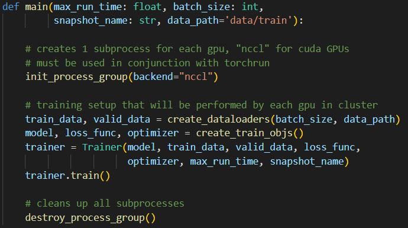
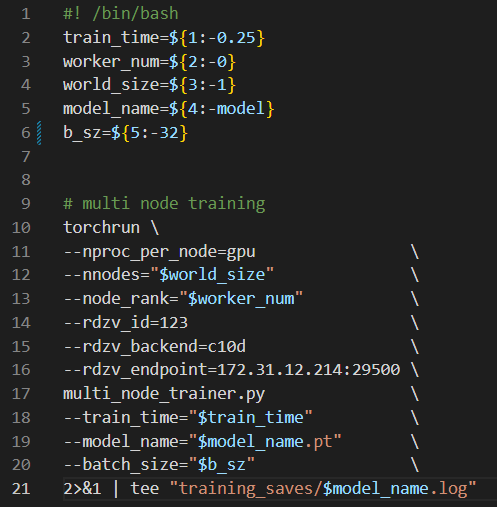

> # __Distributed Machine Learning in PyTorch__  
__This project is intended to explore PyTorch's Distributed ML training capabilities, specifically, the Distributed Data Parallel strategy (DDP).__  
Disclaimer: You will not be able to run this code directly as it depends on a large dataset that is not in this repo (a 20 class slice of https://www.kaggle.com/datasets/ambityga/imagenet100). You will need to make adjustments to the repo code in order to fit your dataset. If you are using this repo directly, I recommend placing your training data into `data/train` and testing data into `data/test`. The main purpose of this repo is to provide example code of how to perform DDP with PyTorch. I will also be exploring PyTorch's model parallelism approach in the future.  
PyTorch Reference: https://pytorch.org/docs/stable/index.html

> ## __Important files__  
file/dir | description  
--- | --- 
model_tester.ipynb | used for testing trained models  
dataloader_visualization.ipynb | visualizing data  
ddp_trainer.py | trainer class definition for DDP training  
multi_node_trainer.py | driver code for single and  multinode training  
scripts/ | used to easily execute training code on EC2 VMs with pytorch's torchrun

> ## __One Worker Script__  
`bash scripts/one_node_train.sh <TRAIN_TIME>  <SAVE_NAME>  <BATCH_SIZE>`  
__Example__:  
`bash scripts/one_node_train.sh 3.0 single_node 32`

> ## __Multi Worker Script__  
`bash scripts/one_node_train.sh <TRAIN_TIME> <WORKER_NUM> <WORLD_SIZE> <SAVE_NAME> <BATCH_SIZE>`  
__Example__: (executed on each participating node)  
`bash scripts/multi_node_train.sh 3.0 0 4 multi_node 32`  
`bash scripts/multi_node_train.sh 3.0 1 4 multi_node 32`  
`bash scripts/multi_node_train.sh 3.0 2 4 multi_node 32`  
`bash scripts/multi_node_train.sh 3.0 3 4 multi_node 32`  
__See useful_server_commands.txt for more examples. Note, need to configure master server IP in scripts/multi_node_train.sh__  

>## __Script Args:__  
`TRAIN_TIME = Total training time in hours`  
`WORKER_NUM = worker number`  
`WORLD_SIZE = Total worker count`    
`SAVE_NAME = Save name for saving snapshots (For fault tolerance) and training metrics`  
`BATCH_SIZE = Batch size per device `  

> # __DDP-Enabling Code in PyTorch__  

> ## __DDP Setup__  
__Import:__  
`from torch.distributed import init_process_group, destroy_process_group`  
__Description:__  
Launches (and destroys) 1 subprocess per GPU, per system.  
__Code:__  
from `multi_node_trainer.py`  

> ## __torchrun__  
__Description:__  
Newer form of `python -m torch.distributed.launch --use_env train_script.py`. torchrun is include in pytorch >= 1.11  
__Bash Script example for running torchrun:__  
from `scripts\multi_node_train.sh`  

> ## __Distributed Sampler__  
__Important Import:__  
`from torch.utils.data.distributed import DistributedSampler`  
__Description:__  
Distributed Sampler that coordinates batch sampling across the cluster. It ensures that each GPU gets different batchs of data.    
__Code:__   
from `multi_node_trainer.py`  

> ## __Model Wrapper__  
__PyTorch Import:__  
`from torch.nn.parallel import DistributedDataParallel as DDP`  
__Description:__  
DDP Wrapper for `torch.nn.Module` models  
__Code:__  
from `ddp_trainer.py`  

> ## __Custom DDP Trainer Class__  
__Trainer Import:__  
`from ddp_trainer import Trainer`  
__Description:__  
Trainer class to assist with DDP training. It provides built-in snapshotting that allows for fault tolerant training sessions. This simply means that if one worker fails during training, the training can be restarted and the latest snapshot will be loaded in on each worker to continue training. All metrics that are related to the state of training, such as run time, epoch number, loss histories, and the model state with the best validation loss (and more) are automatically loaded back in after a training failure has occurred.  
__Snapshotting Code:__   
from `ddp.py`  

> # __Model & Data__

> # __AWS EC2 Experiment Details__
For PyTorch DDP testing I trained the same model with the same data on 1, 2, 4, and 8 AWS EC2 instances.

Instance Type | __g4dn.2xlarge - 8 vCPUs - 1 Nvidia T4 GPU__
---|---
__Network Speed__ | __25 GB/s__

In each experiment, I trained for 2 hours.

> # __My Results with Pytorch's DDP Strategy__
Note: Each Node has 1 GPU

|                           | 1 Node  | 2 Nodes | 4 Nodes | 8 Nodes |
|      ---                  |     --- | ---     | ---     |   ---   |
| __Learning Rate (e-4)__   | 1.00    | 1.41    | 2.00 | 2.83 |
| __Global Batch Size__     | 32      |  64     | 128 | 256 |
| __Steps Per Epoch__       | 650     | 375     | 163 | 82 |
| __Avg Epoch Time(min)__   | xxx     |         |
| __Epoch Num @ 2 hr__      | xxx     |         |
| __Images Per Sec__        | xxx     |       |
| __Scaling Efficiency__    | xxx     |       |
| __Best Validation Loss__  | xxx     |       |
| __Test Loss__             | xxx     |  0.435    | 0.429 
| __Top1 Test Accuracy__    | 86.90%  | 87.30%    | 87.50% | 87.50%

***

># __Cool Summary Graphs__

># __Conclusions on Distributed Training with Pytorch's DDP Strategy__

__Scale up before scaling out!__ 

Depending on network speeds, it is very likely that the communication overhead caused by gradient synchronization between nodes will decrease scaling efficiency as the number of workers increases. I recommend connections that exceed 100GB/s, but even those kinds of speeds do no compare to linked GPU transfer speeds. Because of this, I recommend to perform training on multi GPU systems. It's clear that 1 system with 8 GPUs is better than 8 systems with 1 GPU (not certain, but I think this is likely to be hte case). If scaling beyond just 1 system with 8 GPUs, then one can add additional nodes. This may seem obvious, but it wasn't so obvious to me until this experiment (mostly because 8 nodes are likely to have 8x the number of cpu cores, and it's hard to know just how much those CPU extra CPU cores factor in). More testing will be conducted in the future.